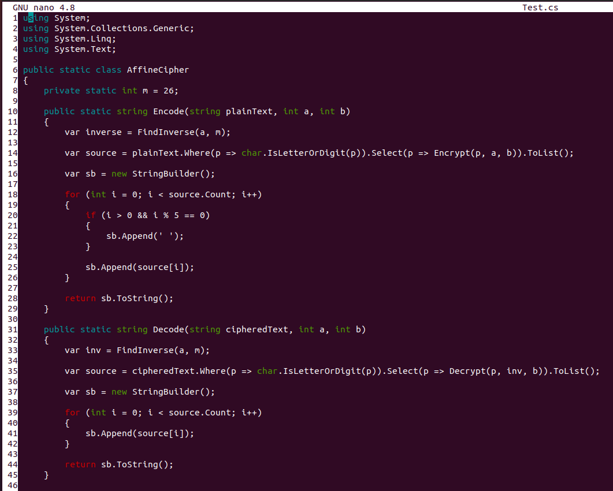

Simple Nano C# Syntax Highlighting
======
A simple configuration to use syntax highlighting for the C# language in the Nano editor.

## The configuration (source)
```
# Syntax highlighting for C#
syntax csharp "\.cs$"
magic "C# Source Code"
comment "//"
color green "\<(bool|byte|sbyte|char|decimal|double|float|int|uint|long|ulong|new|object|short|ushort|string|base|this|void)\>"
color red "\<(as|break|case|catch|checked|continue|default|do|else|finally|fixed|for|foreach|goto|if|is|lock|return|switch|throw|try|unchecked|while)\>"
color cyan "\<(abstract|class|const|delegate|enum|event|explicit|extern|implicit|in|internal|interface|namespace|operator|out|override|params|private|protected|public|readonly|ref|sealed|sizeof|static|struct|typeof|using|virtual|volatile)\>"
color red ""[^\"]*""
color yellow "\<(true|false|null)\>"
color blue "//.*"
color blue start="/\*" end="\*/"
color brightblue start="/\*\*" end="\*/"
color brightgreen,green " +$"
```

## Usage
### Apply changes for your user
Just copy the above configuration into `~/.nanorc` file. If the file doesn't exist *create it yourself*. I've also provided the `raw` file so you could append the configuration directly
```
# Assuming you're currently in this repo.
$ cat raw >> ~/.nanorc
```
### Apply changes system-wide
To enable the configuration system-wide, so others may use it as well, create a file `/usr/share/nano/csharp.nanorc` and insert the configuration.

## How it looks


## A richer alternative
If you want a richer syntax highlighting (sometimes many colors bother me) then check out [this repo!](https://github.com/scopatz/nanorc)

## Bonus
Here are some configuration bonuses in order to make your life a bit easier with Nano.
```
# Setting the tabsize to 4, Nano has a default value of 8 and its too long.
set tabsize 4
# Display line numbers in the editor.
set linenumbers
# Enable mouse interaction.
set mouse
# Enable smooth scrolling.
set smooth
# Automatically converts tabs to spaces.
set tabstospaces
```
A note on `tabstospaces`:*Tab width varies from one system to another. Using tabs in the source code may have unpleasant results if you edit it with a different editor (with different tab width, obviously). Replacing tabs with specific numbers of spaces solves this problem.*
